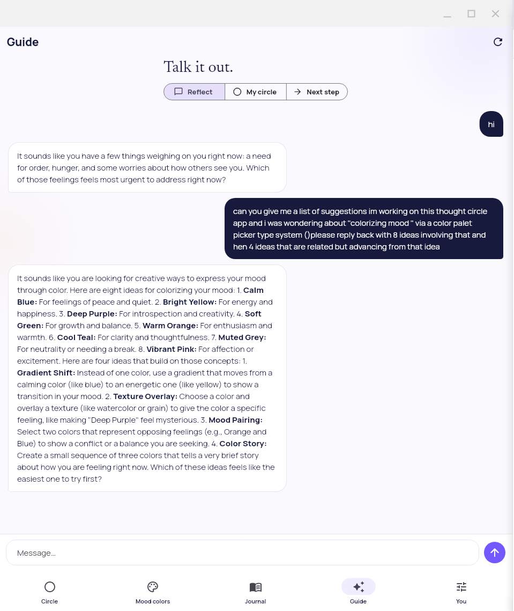
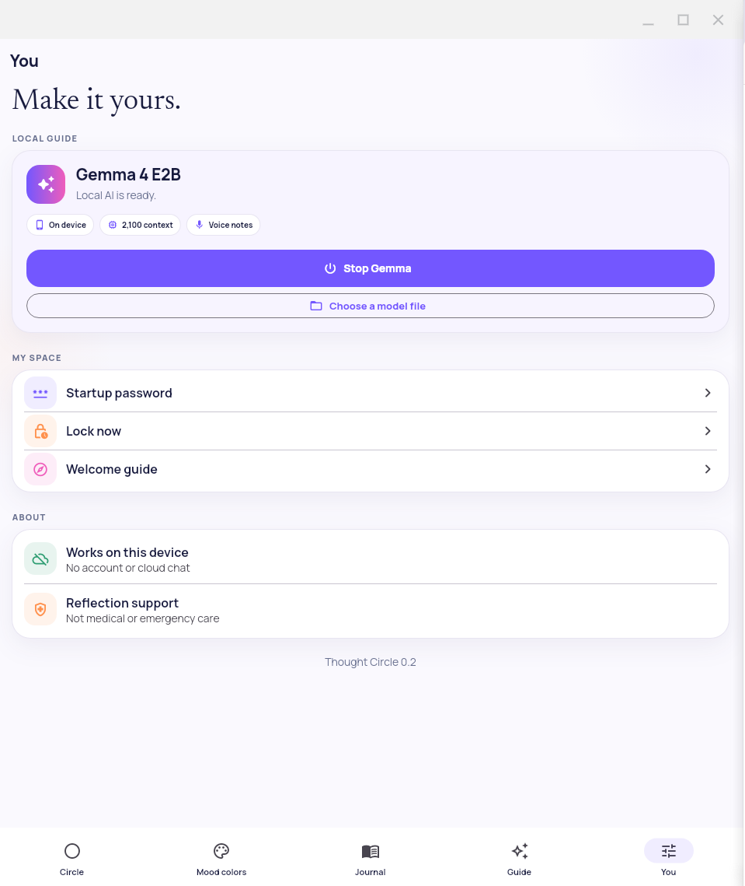
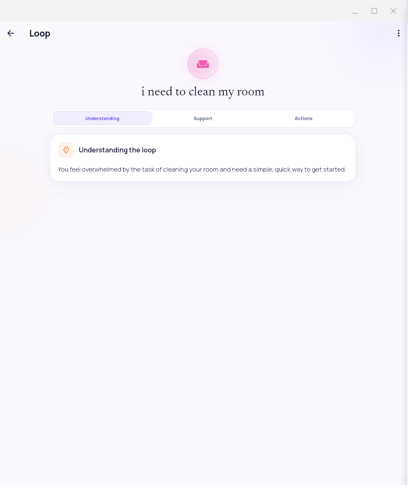
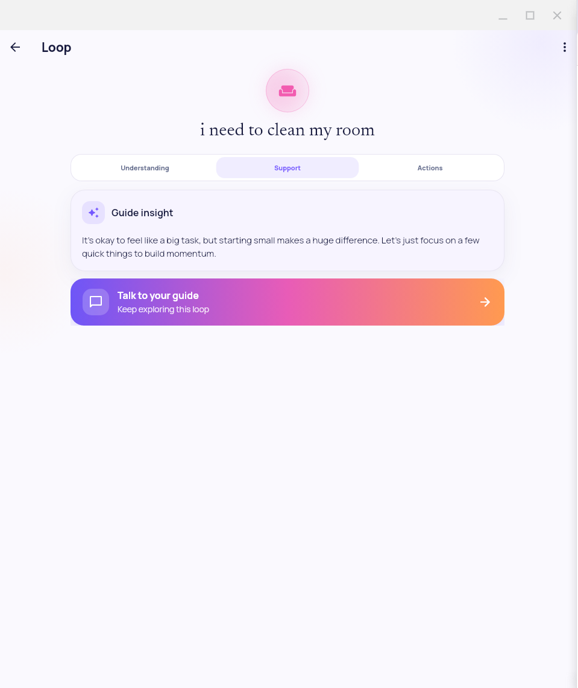
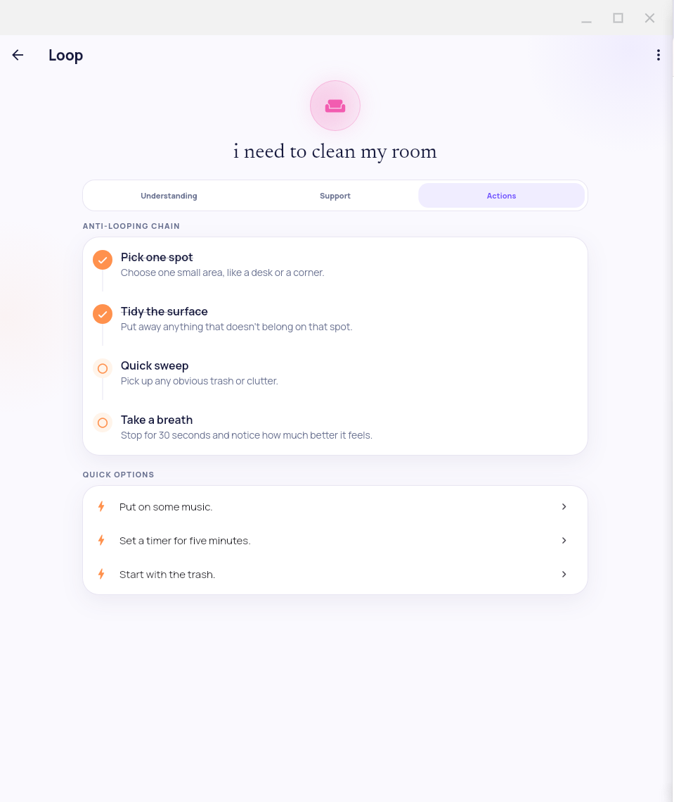
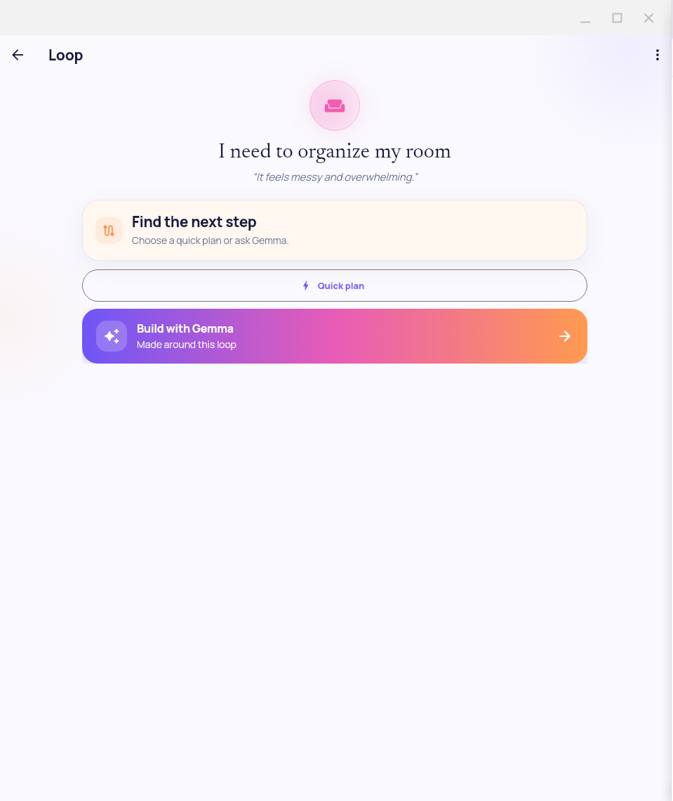
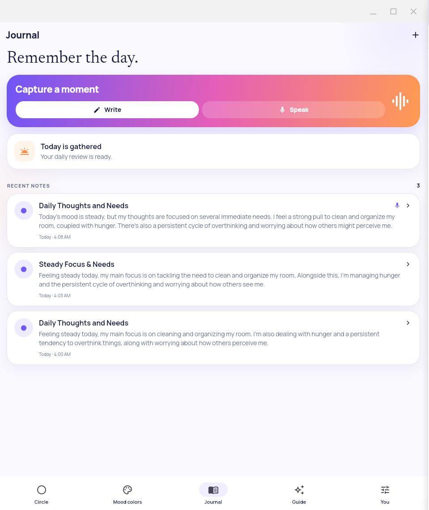
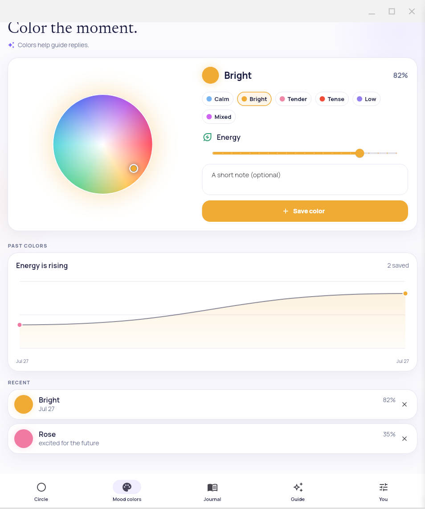

# Thought Circle

Thought Circle is a calm, local-first Flutter app for putting repeating thoughts into a visual circle and turning them into small next steps.

The app combines a visual thought orbit, short reflection plans, a local Gemma guide, typed and voice journaling, and a mood-color timeline. It is designed as a focused everyday tool: name what is taking up space, understand it, and choose one useful next move.

The project was built from the ideas and local-first foundations of [ornab74/naza_one_generation_ui_code](https://github.com/ornab74/naza_one_generation_ui_code), with a new interface and implementation for Thought Circle.

Canonical repository: [github.com/ornab74/thought-circle](https://github.com/ornab74/thought-circle)

## V1 release

[Download Thought Circle v1](https://github.com/ornab74/thought-circle/releases/tag/v1)

V1 includes:

- Local-first thought circle and private journal
- On-device Gemma guide with reflection, support, and next-step chat
- Markdown guide replies with rolling conversation context
- Voice journaling and daily summaries
- Mood Colorizer with visual history
- Starter plans and actionable anti-looping chains
- Android, iOS, Linux, macOS, and Windows support
- No account, ads, analytics, or cloud chat backend

Read the complete [V1 release notes](RELEASE-v1.md).

## Demo gallery

The screenshots in [demo-pics/](demo-pics/) are numbered in capture order. Together they show the main flow from local guide chat, through loop details and planning, to journaling and Mood Colors.

### 01 — Guide chat



The Guide screen keeps the conversation focused with three modes: Reflect, My circle, and Next step. This image shows a user message, a local guide response, and the message composer anchored at the bottom so it remains available while the agent is working.

### 02 — Local guide settings



The You screen contains the Gemma setup card and the small set of account-free controls. Model status, device capabilities, startup password, lock action, and the welcome guide are kept together.

### 03 — Loop understanding



The Understanding tab gives a short plain-language explanation of a loop. The open layout gives the thought and one useful explanation room to breathe before presenting more actions.

### 04 — Guide support



The Support tab presents a warm guide insight and one gradient action to continue the conversation. It demonstrates the app's preference for one clear next action over a dense menu.

### 05 — Anti-looping actions



The Actions tab turns a thought into a short vertical chain. Each step can be checked off, with optional quick actions below for extra momentum.

### 06 — Plan setup



When a loop has no plan yet, the app offers a quick starter plan or a Gemma-built plan. The screen makes the choice clear: start immediately or ask the local model for a plan shaped around the loop.

### 07 — Journal



The Journal screen starts with Write and Speak capture choices. Below are the day's review and recent summarized notes, including mood markers and links back to circle thoughts.

### 08 — Mood Colorizer



Mood Colors lets someone choose a color with the visual wheel or a quick preset, adjust the day's energy, and add a short note. The same screen shows the past-color graph and recent saved colors, making changes easy to notice over time.

## What is included

- Responsive light-mode thought orbit inspired by the concept artwork.
- Demo thoughts such as “I’m hungry” and “I need to organize my room.”
- Add, open, complete, settle, restore, and delete flows.
- Ready-made small-step plans that work without an AI model.
- Optional on-device Gemma 4 E2B planning, journal summaries, and guide chat.
- Rolling guide context sized to stay within the model's 2,100-token input window.
- Markdown rendering for guide headings, emphasis, lists, code, and blockquotes.
- Typed and microphone journal capture with short AI summaries.
- Daily journal reviews and links from journal entries back to circle thoughts.
- Mood Colors with a custom wheel, presets, energy slider, notes, and history graph.
- Recent mood-color patterns passed to local plans and guide replies as tentative self-reported context.
- Resumable Gemma download using saved progress and 8 MB range-request chunks.
- Four-step first-run tour after the startup password.
- Bundled Manrope and Newsreader fonts that work offline.
- Password-locked local storage.
- No account, ads, analytics, or cloud chat backend.

Thought Circle provides general reflection and planning support. It is not medical care, diagnosis, crisis support, or a replacement for a qualified professional.

## Platform support

Flutter desktop builds use the native toolchain for the operating system being built:

| Target | Build from | Native toolchain |
| --- | --- | --- |
| Linux | Linux | Clang, CMake, Ninja, GTK 3 development libraries |
| Windows | Windows | Visual Studio with Desktop development with C++ |
| macOS | macOS | Xcode command-line tools and Xcode |

You cannot normally build a macOS app on Linux or Windows because Apple's Xcode toolchain is required. Windows desktop builds require Windows and Visual Studio. See [Flutter desktop support](https://docs.flutter.dev/platform-integration/desktop).

## Full Dart and Flutter installation

### Dart and Flutter relationship

Flutter includes the Dart SDK. Installing Flutter gives you both the Flutter and Dart command-line tools; a separate Dart SDK installation is normally unnecessary for a Flutter application.

Verify both commands after installation:

~~~text
flutter --version
dart --version
~~~

This project uses the Dart SDK constraint in pubspec.yaml. Use the Flutter stable channel unless your team deliberately pins a release.

For current downloads and the official manual flow, see [Install Flutter manually](https://docs.flutter.dev/install/manual).

### Linux: install Git, Dart, Flutter, and desktop tools

These commands target Debian or Ubuntu. For Fedora, Arch, openSUSE, or another distribution, install equivalent packages with its package manager.

#### 1. Install basic prerequisites

~~~bash
sudo apt-get update
sudo apt-get install -y curl git unzip xz-utils zip libglu1-mesa
~~~

#### 2. Download and unpack Flutter

Create a user-owned development directory:

~~~bash
mkdir -p "$HOME/develop"
cd "$HOME/develop"
~~~

Download the current stable Linux archive from the Flutter SDK archive or the official installation page. The filename changes by release and looks similar to:

~~~text
flutter_linux_<version>-stable.tar.xz
~~~

After downloading it into ~/Downloads, unpack it:

~~~bash
tar -xf "$HOME/Downloads/flutter_linux_<version>-stable.tar.xz" -C "$HOME/develop"
~~~

The result should contain:

~~~text
$HOME/develop/flutter/bin/flutter
$HOME/develop/flutter/bin/dart
~~~

#### 3. Add Flutter and Dart to PATH

For Bash:

~~~bash
echo 'export PATH="$HOME/develop/flutter/bin:$PATH"' >> "$HOME/.bashrc"
source "$HOME/.bashrc"
~~~

For Zsh:

~~~bash
echo 'export PATH="$HOME/develop/flutter/bin:$PATH"' >> "$HOME/.zshrc"
source "$HOME/.zshrc"
~~~

Verify the intended SDK:

~~~bash
which flutter
which dart
flutter --version
dart --version
~~~

#### 4. Install Linux desktop development packages

~~~bash
sudo apt-get install -y \
  clang \
  cmake \
  ninja-build \
  pkg-config \
  libgtk-3-dev \
  libstdc++-12-dev
~~~

These are the packages listed in the official [Linux desktop setup guide](https://docs.flutter.dev/platform-integration/linux/setup).

#### 5. Optional microphone support

Thought Circle can use PipeWire's pw-record for Linux microphone capture. If it is not already installed:

~~~bash
sudo apt-get install -y pipewire pipewire-pulse
~~~

Typing and the rest of the app do not require a microphone.

#### 6. Validate Linux

~~~bash
flutter config --enable-linux-desktop
flutter doctor -v
flutter devices
~~~

You should see a Linux desktop device.

### Windows: install Git, Dart, Flutter, and Visual Studio

Windows desktop compilation requires Windows and Visual Studio. Visual Studio Code is a useful editor, but it does not replace Visual Studio's C++ toolchain.

#### 1. Install Git for Windows

Install [Git for Windows](https://git-scm.com/download/win), open a new PowerShell window, and verify:

~~~powershell
git --version
~~~

#### 2. Install Visual Studio

Install Visual Studio Community, Professional, or Enterprise. In Visual Studio Installer select:

- Desktop development with C++
- A Windows 10 or Windows 11 SDK
- The default MSVC and CMake components included by that workload

See the official [Windows desktop setup guide](https://docs.flutter.dev/platform-integration/windows/setup).

Restart Windows or at least open a new PowerShell window after installation.

#### 3. Download and install Flutter

Download the current stable Windows ZIP from [Install Flutter manually](https://docs.flutter.dev/install/manual). Extract it to a user-writable location such as:

~~~text
C:\src\flutter
~~~

Avoid C:\Program Files for a manually installed SDK because it can create permission problems during upgrades.

Add C:\src\flutter\bin to the User Path environment variable:

1. Open Start and search for Environment Variables.
2. Select Edit the system environment variables.
3. Click Environment Variables.
4. Under User variables, select Path and click Edit.
5. Add C:\src\flutter\bin.
6. Confirm the dialogs and open a new PowerShell window.

PowerShell alternative:

~~~powershell
$flutterBin = "C:\src\flutter\bin"
$userPath = [Environment]::GetEnvironmentVariable("Path", "User")
if ($userPath -notlike "*$flutterBin*") {
  [Environment]::SetEnvironmentVariable("Path", "$userPath;$flutterBin", "User")
}
~~~

Verify:

~~~powershell
where.exe flutter
where.exe dart
flutter --version
dart --version
~~~

#### 4. Validate Windows desktop support

~~~powershell
flutter config --enable-windows-desktop
flutter doctor -v
flutter devices
~~~

If Flutter reports that Visual Studio's C++ workload is missing, open Visual Studio Installer, choose Modify, add Desktop development with C++, and run flutter doctor -v again.

### macOS: install Git, Dart, Flutter, Xcode, and CocoaPods

macOS is required for macOS desktop builds and Apple's iOS toolchain.

#### 1. Install Apple command-line tools and Xcode

~~~bash
xcode-select --install
~~~

If Xcode is already installed, select it:

~~~bash
sudo xcode-select --switch /Applications/Xcode.app/Contents/Developer
sudo xcodebuild -license
~~~

Install Xcode from the Mac App Store if needed, then open it once for first-run setup.

#### 2. Install Homebrew and Git

Homebrew is optional, but useful for maintaining command-line dependencies. Install it from [brew.sh](https://brew.sh/), then run:

~~~bash
brew install git
git --version
~~~

#### 3. Download and install Flutter

Download the current stable macOS archive from [Install Flutter manually](https://docs.flutter.dev/install/manual). Choose the archive matching the Mac:

- Apple Silicon: arm64
- Intel: x64

Unpack the archive downloaded into ~/Downloads:

~~~bash
mkdir -p "$HOME/develop"
tar -xf "$HOME/Downloads/flutter_macos_<version>-stable.tar.xz" -C "$HOME/develop"
~~~

Add Flutter to the Zsh profile:

~~~bash
echo 'export PATH="$HOME/develop/flutter/bin:$PATH"' >> "$HOME/.zprofile"
source "$HOME/.zprofile"
~~~

Verify:

~~~bash
which flutter
which dart
flutter --version
dart --version
~~~

#### 4. Install CocoaPods

Thought Circle uses plugins with native Apple code:

~~~bash
brew install cocoapods
pod --version
~~~

See the official [macOS desktop setup guide](https://docs.flutter.dev/platform-integration/macos/setup).

#### 5. Validate macOS desktop support

~~~bash
flutter config --enable-macos-desktop
flutter doctor -v
flutter devices
~~~

Flutter should list a macOS desktop device.

## Get the project ready

Clone the repository:

~~~bash
git clone https://github.com/ornab74/thought-circle.git
cd thought-circle
~~~

If the repository is already cloned, enter its directory. Replace the path below if you chose a different checkout location:

~~~bash
cd /path/to/thought-circle
~~~

Fetch packages:

~~~bash
flutter pub get
~~~

The repository includes its Linux, Windows, macOS, Android, and iOS platform directories. If a fresh checkout is missing desktop directories, regenerate them from the project root:

~~~bash
flutter create --platforms=linux,windows,macos .
dart run tool/configure_platforms.dart
flutter pub get
~~~

The repository also includes tool/bootstrap.sh and tool/bootstrap.ps1 for environments where all generated platform runners need to be recreated. They are not normally needed when the checked-in platform directories are present.

## Check the project before building

~~~bash
flutter analyze
flutter test
~~~

Format Dart source when making changes:

~~~bash
dart format lib test tool
~~~

The tests cover model JSON round trips, starter plans, vault password flows, authenticated storage, phone and desktop layouts, onboarding, navigation, guide Markdown, the chat composer during model work, and Mood Colors.

## Run Thought Circle in development

List available targets:

~~~bash
flutter devices
~~~

Run the current platform target:

~~~bash
flutter run
~~~

Run an explicit desktop target:

~~~bash
flutter run -d linux
flutter run -d windows
flutter run -d macos
~~~

### Linux software rendering

The checked-in Linux runner forces the X11 backend and software rendering before Flutter initializes. It disables Impeller and Flutter GPU paths, forces Mesa software rendering, and logs the selected configuration during startup.

Normal command:

~~~bash
flutter run -d linux
~~~

Direct debug executable:

~~~bash
./build/linux/x64/debug/bundle/thought_circle
~~~

The startup log should include:

~~~text
Thought Circle platform check: GTK backend=x11; native renderer=software; GPU disabled; Mesa driver=llvmpipe.
~~~

To reinforce the setting from a shell:

~~~bash
FLUTTER_LINUX_RENDERER=software \
LIBGL_ALWAYS_SOFTWARE=1 \
GALLIUM_DRIVER=llvmpipe \
flutter run -d linux
~~~

## Build release applications

Run flutter pub get, flutter analyze, and flutter test before a release build.

### Linux

~~~bash
flutter build linux --release
~~~

Output:

~~~text
build/linux/x64/release/bundle/
~~~

Run it:

~~~bash
./build/linux/x64/release/bundle/thought_circle
~~~

Distribute the complete bundle directory, not only the executable. It contains Flutter's shared libraries and the data directory with fonts and other assets. Check native library dependencies with:

~~~bash
ldd build/linux/x64/release/bundle/thought_circle
~~~

See [Build Linux apps with Flutter](https://docs.flutter.dev/platform-integration/linux/building).

### Windows

Run from a Windows PowerShell prompt:

~~~powershell
flutter build windows --release
~~~

Output:

~~~text
build\windows\x64\runner\Release\
~~~

Run it:

~~~powershell
.\build\windows\x64\runner\Release\thought_circle.exe
~~~

Distribute the complete Release directory, including the executable, DLLs, and data directory. A Windows Flutter desktop application is not a single standalone EXE.

### macOS

Run from macOS:

~~~bash
flutter build macos --release
~~~

Output:

~~~text
build/macos/Build/Products/Release/thought_circle.app
~~~

Open it:

~~~bash
open build/macos/Build/Products/Release/thought_circle.app
~~~

For distribution outside the development Mac, add Apple's normal signing, entitlements, notarization, and packaging steps. A local unsigned build is useful for development but is not automatically a notarized release.

## Local Gemma setup

Thought Circle uses a Gemma 4 E2B LiteRT-LM model. The model is not committed because it is several gigabytes.

Expected file:

~~~text
gemma-4-E2B-it.litertlm
~~~

Pinned SHA-256:

~~~text
ab7838cdfc8f77e54d8ca45eadceb20452d9f01e4bfade03e5dce27911b27e42
~~~

After opening the app, go to You → Local guide:

1. Choose Download Gemma to download saved 8 MB range-request chunks with pause/resume.
2. Or choose Choose a model file to use an existing .litertlm file.
3. After verification, choose Start Gemma.

Linux and Windows select the CPU backend for compatibility. macOS and mobile targets try GPU first and fall back to CPU when available. Guide replies, journal shaping, and plan generation stay local after the model is installed.

## Private storage

User-created thoughts, plans, journal entries, chat turns, and mood colors are stored in separately authenticated local records.

- The startup password is processed with Argon2id.
- A random master key is wrapped by the password-derived key.
- Record names are replaced with keyed identifiers.
- Record values are encrypted with AES-256-GCM and record-specific keys.
- SQLite uses secure deletion, full synchronization, and authenticated read checks.
- Changing the startup password rewraps the master key rather than exposing or rewriting plaintext records.

This is record encryption, not whole-database page encryption. Someone who can read the app files may still infer the database schema, approximate record count, ciphertext sizes, and update timing. See [SECURITY.md](SECURITY.md).

## Project layout

~~~text
assets/fonts/                    Bundled Manrope and Newsreader fonts
demo-pics/                       Numbered application screenshots
lib/app/theme.dart               Light visual system and typography
lib/models/                      Thoughts, journals, chat, and mood colors
lib/screens/                     Circle, mood, journal, guide, and settings
lib/services/gemma_service.dart  Gemma download, audio, chat, and planning
lib/services/vault_service.dart  Local authenticated record store
lib/state/app_controller.dart    App state and workflows
lib/widgets/                     Orbit, logo, cards, and gradient actions
test/                            Model, vault, Markdown, and UI smoke tests
tool/                            Platform configuration and bootstrap scripts
~~~

## Troubleshooting

### flutter or dart is not found

Open a new terminal after changing PATH:

~~~bash
which flutter
which dart
flutter --version
dart --version
~~~

On Windows:

~~~powershell
where.exe flutter
where.exe dart
~~~

If the path points to an old SDK, remove the old Flutter entry or move the intended SDK earlier in PATH.

### flutter doctor reports a platform you do not need

Flutter can report missing Android, iOS, web, or another platform even when the desktop target you need is healthy. You can disable unused platforms, for example:

~~~bash
flutter config --no-enable-android
flutter config --no-enable-ios
flutter config --no-enable-web
~~~

Do not disable the desktop target you intend to build.

### Linux build fails around GTK, CMake, Ninja, or Clang

~~~bash
sudo apt-get install -y clang cmake ninja-build pkg-config libgtk-3-dev libstdc++-12-dev
flutter doctor -v
flutter devices
~~~

### Windows build says Visual Studio or C++ is missing

Open Visual Studio Installer, choose Modify, add Desktop development with C++, select a Windows SDK, then restart PowerShell and run:

~~~powershell
flutter doctor -v
~~~

### macOS build fails around Xcode or CocoaPods

~~~bash
xcode-select --install
sudo xcode-select --switch /Applications/Xcode.app/Contents/Developer
brew install cocoapods
flutter doctor -v
~~~

Open Xcode once, accept its license, and allow it to install requested components.

### The Linux window is not responsive or the GPU is unstable

Use the checked-in Linux runner and confirm the startup log contains native renderer=software; GPU disabled:

~~~bash
flutter run -d linux
~~~

You can also launch with explicit environment variables:

~~~bash
FLUTTER_LINUX_RENDERER=software LIBGL_ALWAYS_SOFTWARE=1 GALLIUM_DRIVER=llvmpipe flutter run -d linux
~~~

### The guide is unavailable

The circle, starter plans, journal writing, and Mood Colors work without Gemma. To use local guide features, install or download the verified .litertlm model from You → Local guide, then select Start Gemma.

### The microphone button does not record

Check that the operating system grants microphone access. On Linux, check that pw-record is installed and can see an input device. On macOS, check System Settings → Privacy & Security → Microphone. On Windows, check Settings → Privacy & security → Microphone.

## Design direction

The user-facing copy avoids technical and clinical language. The visual system is intentionally quiet:

- warm white background
- dark navy text
- purple, pink, orange, and mood-derived accents
- rounded cards with restrained shadows
- Manrope for interface text
- Newsreader for expressive headings
- one clear action at a time

## License and notices

Thought Circle's project notice is in [NOTICE.md](NOTICE.md). The bundled Manrope and Newsreader typefaces are distributed under the SIL Open Font License 1.1; their license texts are included in [assets/fonts/](assets/fonts/).

## GitHub Actions builds and signing

The workflow in [.github/workflows/flutter.yml](.github/workflows/flutter.yml) builds Android, Linux, Windows, macOS, and iOS on pushes to `main`, version tags, pull requests, and manual runs. It always produces unsigned/testable binaries. Release signing is opt-in: add the relevant secrets and run a `v*` tag or choose **Run workflow**. Pull requests never receive signing credentials.

### Android signing and Play Store

Create an upload key on Windows with JDK 17. Install Temurin if necessary:

```powershell
winget install EclipseAdoptium.Temurin.17.JDK
keytool -genkeypair -v -keystore thought-circle-upload.jks -alias thought-circle-upload -keyalg RSA -keysize 2048 -validity 10000
[Convert]::ToBase64String([IO.File]::ReadAllBytes('.\\thought-circle-upload.jks')) | Set-Clipboard
```

In GitHub, create a protected `production` environment and add `ANDROID_KEYSTORE_B64`, `ANDROID_KEYSTORE_PASSWORD`, `ANDROID_KEY_ALIAS`, and `ANDROID_KEY_PASSWORD`. Keep the JKS and passwords offline; never commit them. The workflow writes a temporary `android/key.properties`, signs the AAB/APK, and removes it with the runner.

Create a Google Play Console developer account, create the app using package ID `com.thoughtcircle.thought_circle`, enroll in Play App Signing, and upload the AAB from the Actions artifact. For automated upload, create a Google Cloud service account, grant it Play Console release access, download its JSON key, and save the complete JSON as `GOOGLE_PLAY_SERVICE_ACCOUNT_JSON`. Store upload permission only in the production environment.

### Apple macOS and iOS

Apple desktop signing needs an Apple Developer team, a Developer ID Application certificate, and notarization credentials. Add `MACOS_CERTIFICATE_P12_B64`, `MACOS_CERTIFICATE_PASSWORD`, `MACOS_CODESIGN_IDENTITY`, `APPLE_ID`, `APPLE_APP_SPECIFIC_PASSWORD`, and `APPLE_TEAM_ID` as production secrets. The macOS job can then sign the `.app`, create a DMG, submit it with `xcrun notarytool`, and staple the result.

For iOS, register the bundle ID in Apple Developer, create an App Store distribution certificate and App Store provisioning profile, then add `IOS_CERTIFICATE_P12_B64`, `IOS_CERTIFICATE_PASSWORD`, `IOS_PROVISIONING_PROFILE_B64`, and `IOS_EXPORT_OPTIONS_PLIST_B64`. The iOS artifact is an IPA only after those secrets and a matching Xcode signing setup are supplied. Upload it with Transporter or App Store Connect.

### Windows Store

Enroll in Microsoft Partner Center, reserve the Thought Circle name, and copy the Product Identity values into the project’s MSIX manifest. For Store builds, add the publisher identity and certificate secrets required by your organization, then add an MSIX packaging step to the Windows job. Upload the generated MSIX in Partner Center, complete age-rating and privacy forms, and submit it for certification. Store-managed signing is preferable for Store distribution; a PFX is needed for direct sideload distribution.

### Linux packages and Ubuntu Store

The Linux artifact is a Flutter bundle. A Debian package can be made on Ubuntu with:

```bash
sudo apt-get install -y dpkg-dev
mkdir -p pkg/DEBIAN pkg/opt/thought-circle pkg/usr/bin pkg/usr/share/applications
cp -a build/linux/x64/release/bundle/. pkg/opt/thought-circle/
printf '#!/bin/sh\nexec /opt/thought-circle/thought_circle "$@"\n' > pkg/usr/bin/thought-circle
chmod 755 pkg/usr/bin/thought-circle
cp packaging/linux/thought-circle.desktop pkg/usr/share/applications/
dpkg-deb --build pkg thought-circle_0.1.0_amd64.deb
```

For Fedora, install `rpm-build`, stage the same bundle under `/opt/thought-circle`, and build an RPM with `rpmbuild -bb` using a spec that installs the executable, desktop file, and GTK runtime dependencies. For Arch, update `packaging/arch/PKGBUILD`, place the release tarball beside it, and run `makepkg -si`. AUR does not use a `.aur` file: it is a Git repository containing a `PKGBUILD`; push that recipe to a user-owned AUR repository after testing it locally.

Ubuntu’s app marketplace is the Snap Store rather than an apt repository. Install Snapcraft, reserve the snap name at [snapcraft.io](https://snapcraft.io/), run `snapcraft login`, build with `snapcraft pack`, and upload with `snapcraft upload --release=stable thought-circle_*.snap`. For CI, export store credentials with `snapcraft export-login`, save the output as the protected `SNAPCRAFT_STORE_CREDENTIALS` secret, and pass it only to a tag/manual release job. Snap Store signing is handled by the store.

### Secret safety

Use GitHub Actions environments with required reviewers for production releases. Limit workflow permissions to `contents: read`, use short-lived cloud credentials where supported, rotate compromised keys immediately, and inspect the Actions log to ensure no decoded key or password is printed. GitHub’s encrypted secrets are available to release jobs, not forked pull requests.
